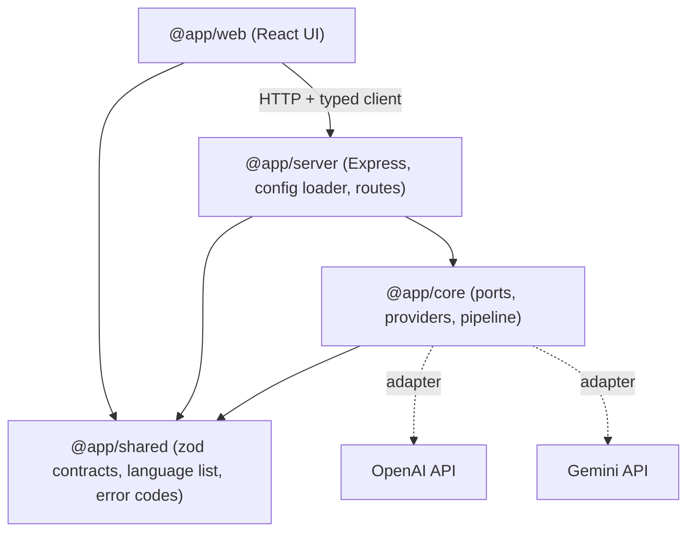
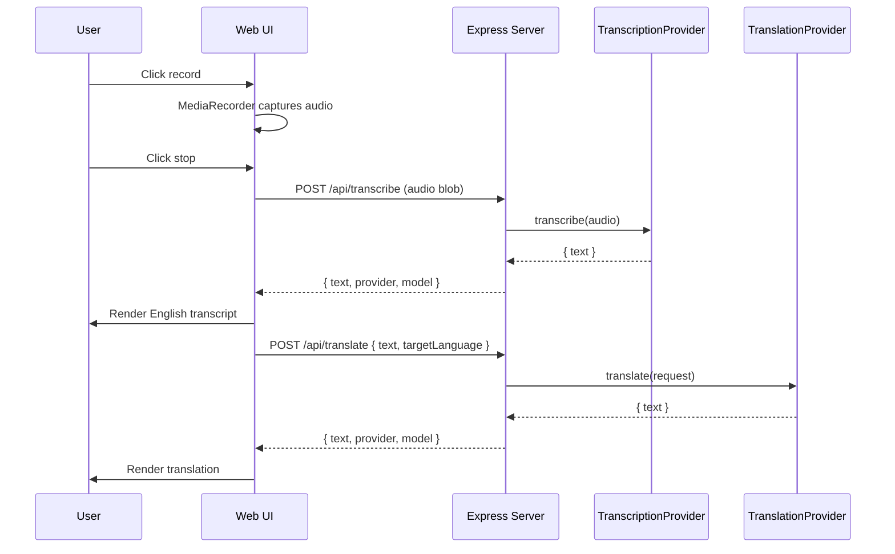

# Speech Translation Web App — Technical Spec

## 1. Purpose

A locally hosted web app where a user:

1. Clicks a button to start recording, clicks again to stop.
2. Sees the English transcript of what they said appear on screen.
3. Sees that transcript translated into a target language they picked from a dropdown.

The system is built so that every external dependency (speech-to-text vendor, translation vendor, hosting target) sits behind an interface and can be swapped by editing config, not code.

## 2. Decisions Locked In

- **Speech-to-text:** pluggable provider interface. OpenAI is the default implementation; Gemini and the browser's Web Speech API are alternates.
- **Translation:** pluggable provider interface. Gemini is the default; OpenAI is the alternate.
- **Stack:** pnpm workspace monorepo — Vite + React frontend, Express backend, shared contracts package, provider core package.
- **Target language:** dropdown of 15 common languages, chosen per session.
- **Config:** `config/config.json` (gitignored) with a committed `config/config.example.json` template. API keys live here.
- **Recording:** click to start, click again to stop, then process.

## 3. Architecture

### 3.1 Dependency direction

Dependencies point inward. The core package knows nothing about Express or React; the server knows nothing about which vendor is active beyond a string in config.



### 3.2 Runtime flow

The transcript is fetched and rendered *before* translation starts, so the user sees their words immediately rather than waiting on two sequential API calls.



### 3.3 Repository layout

```
greenfield_ai/
├── package.json                  # workspace root, scripts
├── pnpm-workspace.yaml
├── tsconfig.base.json            # strict: true, shared compiler options
├── .gitignore                    # ignores config/config.json
├── SPEC.md
├── README.md
├── config/
│   ├── config.example.json       # committed template
│   └── config.json               # gitignored, user fills in keys
└── packages/
    ├── shared/                   # @app/shared
    │   └── src/
    │       ├── contracts.ts      # zod schemas + inferred request/response types
    │       ├── languages.ts      # LANGUAGES const + LanguageCode type
    │       ├── errors.ts         # AppError, ErrorCode enum
    │       └── index.ts
    ├── core/                     # @app/core
    │   └── src/
    │       ├── ports/
    │       │   ├── transcription-provider.ts
    │       │   └── translation-provider.ts
    │       ├── providers/
    │       │   ├── transcription/
    │       │   │   ├── openai-transcription.ts
    │       │   │   ├── gemini-transcription.ts
    │       │   │   └── passthrough-transcription.ts
    │       │   └── translation/
    │       │       ├── gemini-translation.ts
    │       │       └── openai-translation.ts
    │       ├── registry.ts       # name -> factory maps
    │       ├── pipeline.ts       # SpeechTranslationPipeline use case
    │       └── index.ts
    ├── server/                   # @app/server
    │   └── src/
    │       ├── config/
    │       │   ├── schema.ts     # zod schema for config.json
    │       │   └── load-config.ts
    │       ├── routes/
    │       │   ├── health.ts
    │       │   ├── config.ts
    │       │   ├── transcribe.ts
    │       │   └── translate.ts
    │       ├── middleware/
    │       │   ├── error-handler.ts
    │       │   └── upload.ts     # multer, memory storage, size limit
    │       ├── create-app.ts     # takes deps, returns Express app (testable)
    │       └── main.ts           # composition root: load config -> build providers -> listen
    └── web/                      # @app/web
        └── src/
            ├── api/client.ts     # typed fetch wrapper
            ├── audio/
            │   ├── speech-capture.ts        # SpeechCapture port
            │   ├── media-recorder-capture.ts
            │   └── web-speech-capture.ts
            ├── hooks/
            │   ├── use-speech-capture.ts
            │   └── use-translation-session.ts  # the state machine
            ├── components/
            │   ├── RecordButton.tsx
            │   ├── LanguageSelect.tsx
            │   ├── TextPanel.tsx
            │   └── ErrorBanner.tsx
            ├── App.tsx
            └── main.tsx
```

## 4. Core Interfaces

These two ports are the entire extension surface. Adding a vendor means writing one file and adding one line to the registry.

```ts
// packages/core/src/ports/transcription-provider.ts
export interface AudioInput {
  data: Buffer;
  mimeType: string;
  filename: string;
}

export interface TranscriptionResult {
  text: string;
  detectedLanguage?: string;
  provider: string;
  model: string;
}

export interface TranscriptionProvider {
  readonly name: string;
  transcribe(input: AudioInput, opts?: { sourceLanguage?: string }): Promise<TranscriptionResult>;
}
```

```ts
// packages/core/src/ports/translation-provider.ts
export interface TranslationRequest {
  text: string;
  sourceLanguage: string;   // "en"
  targetLanguage: string;   // LanguageCode
}

export interface TranslationResult {
  text: string;
  provider: string;
  model: string;
}

export interface TranslationProvider {
  readonly name: string;
  translate(req: TranslationRequest): Promise<TranslationResult>;
}
```

The pipeline composes them and is the only place the two-step sequence is encoded on the server side:

```ts
// packages/core/src/pipeline.ts
export class SpeechTranslationPipeline {
  constructor(
    private readonly transcriber: TranscriptionProvider,
    private readonly translator: TranslationProvider,
  ) {}

  transcribe(audio: AudioInput) { return this.transcriber.transcribe(audio); }
  translate(req: TranslationRequest) { return this.translator.translate(req); }
}
```

### 4.1 Registry

```ts
// packages/core/src/registry.ts
const transcriptionFactories = {
  openai: (cfg) => new OpenAiTranscriptionProvider(cfg),
  gemini: (cfg) => new GeminiTranscriptionProvider(cfg),
  passthrough: () => new PassthroughTranscriptionProvider(),
} satisfies Record<string, TranscriptionFactory>;

export function createTranscriptionProvider(name: string, cfg: ProviderConfig): TranscriptionProvider;
export function createTranslationProvider(name: string, cfg: ProviderConfig): TranslationProvider;
```

Unknown provider names fail at boot with a message listing the valid options.

### 4.2 The browser Web Speech API case

Web Speech runs entirely in the browser, so it does not fit the server-side `TranscriptionProvider` port. It is modeled on the frontend instead, behind a parallel port:

```ts
// packages/web/src/audio/speech-capture.ts
export interface SpeechCapture {
  readonly mode: 'audio-upload' | 'local-text';
  start(): Promise<void>;
  stop(): Promise<{ audio?: Blob; text?: string }>;
}
```

- `MediaRecorderCapture` returns an audio `Blob`, which the app POSTs to `/api/transcribe`.
- `WebSpeechCapture` returns `text` directly, and the app skips the transcribe call.

`PassthroughTranscriptionProvider` exists on the server so `/api/transcribe` stays contract-complete (it echoes a supplied text field) if you later want a client that always posts text.

## 5. Configuration

`config/config.example.json` (committed, keys blank):

```json
{
  "server": {
    "host": "127.0.0.1",
    "port": 8787,
    "corsOrigins": ["http://localhost:5173"]
  },
  "apiKeys": {
    "openai": "",
    "gemini": ""
  },
  "providers": {
    "transcription": {
      "active": "openai",
      "openai": { "model": "gpt-4o-transcribe" },
      "gemini": { "model": "gemini-2.5-flash" }
    },
    "translation": {
      "active": "gemini",
      "gemini": { "model": "gemini-2.5-flash" },
      "openai": { "model": "gpt-4o-mini" }
    }
  },
  "audio": {
    "maxUploadBytes": 25000000
  },
  "languages": {
    "default": "es"
  }
}
```

Loading rules, implemented in `packages/server/src/config/load-config.ts`:

- Path resolves from `CONFIG_PATH` env var, defaulting to `config/config.json`.
- Parsed and validated with a zod schema; on failure the process exits with the specific field paths that are wrong.
- Environment variables override file values where set: `OPENAI_API_KEY`, `GEMINI_API_KEY`, `PORT`, `HOST`, `CORS_ORIGINS`. This is what makes moving off localhost a config change rather than a code change.
- The key for the *active* provider is required; the other may be blank.
- Config is loaded once in `main.ts` and passed down. Nothing else reads `process.env` or the filesystem.

## 6. HTTP API

All request/response shapes are zod schemas in `@app/shared`, imported by both server and web so the contract cannot drift.

- `GET /api/health` → `{ status: "ok" }`
- `GET /api/config` → `{ languages: Language[], defaultLanguage: string, providers: { transcription: string, translation: string } }` — lets the UI render the dropdown and a provider badge without hardcoding anything.
- `POST /api/transcribe` — `multipart/form-data`, field `audio`. → `{ text, detectedLanguage?, provider, model }`
- `POST /api/translate` — JSON `{ text, targetLanguage, sourceLanguage? }` → `{ text, provider, model }`

Errors use a single shape: `{ error: { code, message } }`, with codes from `@app/shared/errors` (`MISSING_AUDIO`, `AUDIO_TOO_LARGE`, `PROVIDER_ERROR`, `INVALID_REQUEST`, `CONFIG_ERROR`). The error middleware maps `AppError` to status codes and scrubs vendor responses so keys never leak into a client payload.

## 7. Frontend Behavior

`useTranslationSession` owns an explicit state machine; components are presentational.

```
idle → requestingPermission → recording → transcribing → translating → done
                     ↓             ↓            ↓             ↓
                   error         error        error         error  → idle
```

UI elements:

- **Record button** — label and color driven by state (`Start recording` / `Stop recording` / disabled while processing). Shows a recording timer.
- **Language dropdown** — populated from `GET /api/config`, persisted to `localStorage`.
- **Transcript panel** — renders as soon as `/api/transcribe` resolves, with a "listening…" / "transcribing…" placeholder before that.
- **Translation panel** — separate panel below, with its own loading state.
- **Error banner** — dismissible, shows `error.message`, leaves prior results on screen.

Microphone access uses `navigator.mediaDevices.getUserMedia({ audio: true })`. A permission-denied result produces a specific, actionable message rather than a generic failure.

API base URL comes from `import.meta.env.VITE_API_BASE_URL`, defaulting to `/api` with a Vite dev-server proxy to the Express port. Pointing the app at a deployed backend is a one-line `.env` change.

## 8. Languages

`packages/shared/src/languages.ts` exports a frozen array of 15 entries, each `{ code, label, nativeLabel }`:

Spanish, French, German, Italian, Portuguese (Brazil), Chinese (Simplified), Japanese, Korean, Russian, Arabic, Hindi, Dutch, Polish, Turkish, Vietnamese.

`LanguageCode` is derived from the array, so the dropdown, the zod request schema, and the translation prompt all share one source of truth. Adding a language is a one-line edit.

## 9. Tooling and Scripts

- pnpm workspaces, TypeScript `strict: true`, project references between packages.
- ESLint (typescript-eslint) + Prettier.
- `tsx` for server dev with watch; Vite for the web dev server.
- Root scripts: `pnpm dev` (concurrently runs server + web), `pnpm build`, `pnpm test`, `pnpm lint`, `pnpm typecheck`.

## 10. Testing

Vitest, focused on the seams rather than exhaustive coverage:

- `pipeline.test.ts` — uses fake providers, asserts orchestration without touching the network.
- Provider adapter tests — mocked `fetch`, verify request shape and that vendor errors map to `AppError`.
- `load-config.test.ts` — valid config, missing key for active provider, env override precedence.
- Route tests via supertest against `createApp(deps)` with fake providers injected.

## 11. Hosting Switch

Local default is `127.0.0.1:8787` (API) and `localhost:5173` (web). To move off localhost:

1. Set `server.host` to `0.0.0.0` and add the public origin to `corsOrigins` (or set `HOST` / `CORS_ORIGINS` env vars).
2. Set `VITE_API_BASE_URL` to the deployed API URL and run `pnpm build`.
3. Optionally have Express serve `packages/web/dist` as static files behind the same origin, making step 2 unnecessary. This will be behind a `server.serveStatic` boolean in config.

No application code changes in any of these paths.

## 12. Out of Scope (v1)

Streaming/live transcription, text-to-speech playback of the translation, conversation history or persistence, authentication, multi-user support, non-English source languages (the source is fixed to English, though the port already accepts a `sourceLanguage` for later).
